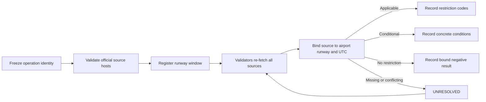

# RunwayScope

**Consensus-backed applicability checks for FAA notices and one frozen runway operation window.**

RunwayScope is a standalone GenLayer Intelligent Contract. It binds official FAA/NAS and NWS evidence to an exact airport, runway, operation type, aircraft category, and UTC window, then records whether a restriction applies. It does not determine disruption cause, liability, compensation, or flight clearance.

> RunwayScope is an evidence-indexing primitive, not operational or safety advice. Always use authoritative aviation channels and qualified dispatch personnel.

## Live release

| Surface | Value |
| --- | --- |
| Repository | [github.com/Jinchainne/runway-scope](https://github.com/Jinchainne/runway-scope) |
| Network | GenLayer Bradbury testnet |
| Contract | [`0x0b45...0DEc`](https://explorer-bradbury.genlayer.com/address/0x0b45bb9a2d542C46FD4a615E32AB3107507f0DEc) |
| Deployment transaction | [`0xc829...fdc7`](https://explorer-bradbury.genlayer.com/tx/0xc8299a66c4d358182c9e831d8d949900aa29b7f26c34ffc51c694a0d6a70fdc7) |
| Deployment status | `ACCEPTED / AGREE / FINISHED_WITH_RETURN` |

Bradbury GEN is faucet-issued test currency with no promised monetary value.

## Why GenLayer is essential

A deterministic contract can validate timestamps and hostnames but cannot interpret whether natural-language notices actually apply to one operation. RunwayScope uses GenLayer-native consensus:

1. `gl.nondet.web.render(...)` independently fetches FAA NOTAM, FAA/NAS, and NWS sources.
2. Each source receives its own 6,000-character budget.
3. Validators classify every source as `BOUND`, `UNBOUND`, or `UNAVAILABLE`.
4. Every bound source requires a literal grounded excerpt and a SHA-256 snapshot digest.
5. `gl.nondet.exec_prompt(...)` returns a strict applicability schema.
6. `gl.vm.run_nondet_unsafe(...)` requires agreement on the result, restriction codes, conditions, source bindings, snapshot digests, and grounded excerpts. A validator cannot accept a different concrete operational condition or evidence snapshot.
7. Consensus materially updates persistent contract state.

## Workflow



## State machine

```text
REGISTERED -> APPLICABLE_RESTRICTION
           -> CONDITIONAL_OPERATION
           -> NO_APPLICABLE_RESTRICTION
           -> UNRESOLVED -> retry assessment
```

## Safety invariants

- Exact allowlists reject deceptive subdomains, userinfo, insecure schemes, custom ports, and fragments.
- Runway designators, aircraft category, operation type, and a maximum 24-hour UTC window are validated before storage.
- Missing primary NOTAM evidence fails closed to `UNRESOLVED`.
- A restriction requires a bound NOTAM and an allowlisted restriction code.
- A no-restriction result also requires a bound NOTAM; generic or unbound pages can never clear an operation.
- Bound excerpts must be literal substrings of the validator's fetched snapshot.
- Terminal assessments cannot be overwritten; only unresolved evidence can be retried.

## Project structure

```text
runway-scope/
|-- contracts/
|   `-- runway_scope.py            # Intelligent Contract
|-- deployments/
|   `-- bradbury.json              # Accepted deployment record
|-- docs/
|   |-- ARCHITECTURE.md            # Consensus and trust boundaries
|   `-- DEPLOYMENT.md              # Reproducible release procedure
|-- submission-pack/
|   `-- SUBMISSION.md              # Builder submission content
|-- tests/
|   `-- test_contract_behavior.py  # Behavioral security tests
|-- LICENSE
|-- SECURITY.md
`-- requirements.txt
```

## Public methods

Writes: `register_window`, `assess_window`.

Views: `get_window`, `list_window_ids`, `get_policy`.

The current release is contract-first: callers submit `register_window` and `assess_window` through a GenLayer-compatible wallet/client and read the resulting state with the view methods above. The contract is the source of truth; a UI must not treat a transaction hash as an assessment until the receipt is finalized and `get_window` returns the persisted result.

## Verification

```bash
python -m pytest tests/test_contract_behavior.py -q
python -m py_compile contracts/runway_scope.py
python -m genvm_linter.cli check contracts/runway_scope.py
```

## License

MIT. See [LICENSE](LICENSE).
